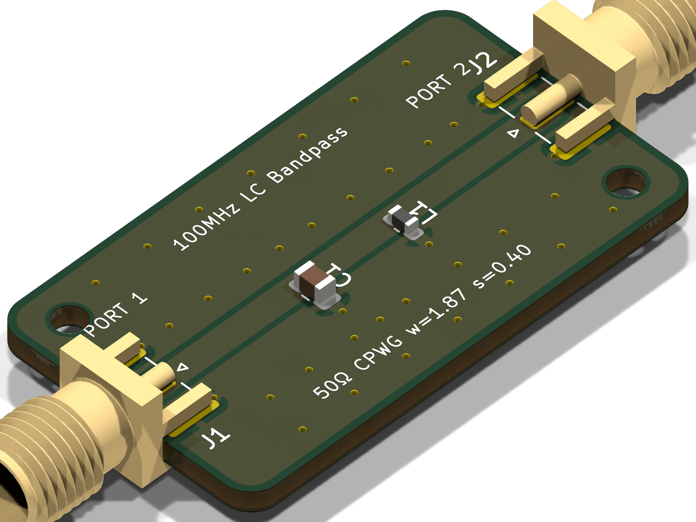

# RF Agent

[](https://kicad.org/)
[](https://www.freecad.org/)
[](https://openems.de/)
[](https://ra3xdh.github.io/)
[](https://ngspice.sourceforge.io/)
[](https://www.python.org/)
[](https://github.com/cholan2100/rf-suite)

An autonomous AI RF/Microwave hardware engineering engine and PCB design suite.

> [!IMPORTANT]
> **AI Harness Native**: This project is explicitly designed to be used inside an AI Agent Harness environment (such as Google's Antigravity, Cursor, Claude Code, GitHub Copilot Workspace, OpenDevin, etc.). 
> 
> **Intended Workflow**:
> 1. Check out this repository inside your AI harness.
> 2. Ask the harness agent to design an RF PCB (e.g., "Design a 10dB 2.4GHz Attenuator").
> 3. The agent will read the provided instructions (`AGENTS.md` / `SKILLS.md`), follow the 9-stage engineering protocol, and synthesize the schematics, route the layout, and run the simulations autonomously.

`rf-agent` enables AI coding agents to autonomously synthesize schematics, route controlled-impedance coplanar waveguides, perform headless DRC verification, execute 3D electromagnetic FDTD simulations, and generate production-ready Gerber archives and raytraced 3D visualizations.

---

## Toolchain Architecture: Dependency on `rf-suite`

`rf-agent` is structured as a decoupled, two-tier architecture separating **AI Agent Design Intellect** from the **Heavy EDA & Solver Toolchain**:

```
┌────────────────────────────────────────────────────────────────────────┐
│                          rf-agent (This Repo)                          │
│                   AI Agent Intellect & Workflow Core                   │
│  - Circuit Spec Synthesis (spec.py) & Passive Math (Pi, Tank, BPF, SOLT)│
│  - Programmatic KiCad 10 Schematic & Layout Routing (agent/pcb_gen.py) │
│  - Controlled-Impedance CPWG Math, Tapers, & Via Fencing Synthesis     │
│  - Automated Headless 9-Stage Pipeline Orchestrator (agent/workflow.py) │
│  - Interactive Human-in-the-Loop Review Protocols & Popups             │
└───────────────────────────────────┬────────────────────────────────────┘
                                    │ invokes via rf-suite/bin launchers
                                    ▼
┌────────────────────────────────────────────────────────────────────────┐
│                        rf-suite (Linked Submodule)                     │
│               Containerized Multi-Physics Engineering Stack            │
│  - KiCad 10.0.4: pcbnew Python C++ bindings, kicad-cli, 3D Raytracer   │
│  - FreeCAD 1.0.0: FreeCADCmd, Microwave Workbench, STEP Exporter      │
│  - openEMS v0.37.0-rc2: 3D FDTD Full-Wave EM Solver & CSXCAD API       │
│  - Qucs-S 24.4.1 & qucsator-rf 1.0.3: Linear S-Parameter Co-Simulation │
│  - ngspice 44.2: Non-linear SPICE DC bias & transient sweeps           │
│  - RF Python Stack: scikit-rf, numpy, scipy, matplotlib, cairosvg      │
│  - X11 / noVNC Web Desktop: Interactive visual GUI on port 6080       │
└────────────────────────────────────────────────────────────────────────┘
```

The underlying toolchain is linked as a Git submodule at `./rf-suite` pointing to [`cholan2100/rf-suite`](https://github.com/cholan2100/rf-suite). This guarantees that neither developers nor autonomous agents need to manually compile or install gigabytes of complex C++ EDA tools on the host system.

---

## Docker Environment & Host OS Architecture

The Docker container daemon location depends on the host operating system:
- **Windows**: Docker is by default found and hosted inside the **WSL Debian** environment (`wsl -d Debian`). When running Docker commands directly on Windows, execute them via WSL: `wsl -d Debian bash -c "docker ..."`. The Windows batch scripts in `rf-suite\bin\` (`rf-run.bat`, `rf-bash.bat`, `rf-gui.bat`) automatically detect this and target the WSL Debian container environment.
- **Linux**: Docker is typically native and accessible directly in the standard system PATH (`docker ...`).

---

## Docker Readiness & Auto-Build Protocol for Agents

Autonomous agents and automated CI runners must adhere to the **Turn 0 Readiness Protocol**:

1. **Test Docker Readiness**:
   Before launching any design stage (e.g. Task 1 Schematic), the agent tests whether the `rf-suite` Docker image is available:
   ```bash
   # On Windows (Docker is in WSL Debian by default):
   wsl -d Debian bash -c "docker images -q rf-suite:latest"
   # Or test via the batch launcher: rf-suite\bin\rf-run.bat python --version

   # On Linux (Native Docker):
   docker images -q rf-suite:latest
   ```

2. **If NOT Ready (Image Missing or Needs Build)**:
   - The agent **informs the user in chat immediately**:
     > *"The `rf-suite` Docker environment is not built yet. Building the Docker image now via `rf-suite/docker-compose.yml`... This builds the container with KiCad 10, FreeCAD 1.0, openEMS, Qucsator-RF, and the RF Python toolchain. I will keep you updated on progress."*
   - The agent triggers the build:
     ```bash
      # On Windows (Docker in WSL Debian):
      wsl -d Debian bash -c "cd /mnt/d/Workspace/rf/rf-agent/rf-suite && docker compose build"
      # Or if native Docker CLI is in Windows PATH:
      cd rf-suite && docker compose build

      # On Linux (Native Docker):
      cd rf-suite && docker compose build
      ```
    - When the build finishes, the agent notifies the user:
      > *"The `rf-suite` Docker environment has been built and verified! Proceeding to Task 1 (Schematic Synthesis)..."*

3. **If Ready**:
   The agent proceeds directly into circuit synthesis.

---

## Key Capabilities

- **Autonomous AI Agent Native**: Orchestrated by `agent.workflow` with programmatic KiCad (`pcbnew`), FreeCAD, openEMS, and Qucsator interfaces for complete headless hardware design.
- **Controlled-Impedance Synthesis**: Grounded Coplanar Waveguide (CPWG) synthesis with closed-form conformal mapping equations for 50Ω transmission lines, 45° neckdown tapers, and ground via fences.
- **Multi-Port & 1-Port Support**: Full support for 2-port circuits (filters, attenuators, power dividers) and dedicated 1-port termination/calibration standards (loads, shorts, opens) with single-ended Return Loss ($S_{11}$) and VSWR verification.
- **Headless Design Rule Checks (DRC)**: Automated zero-tolerance DRC audits verifying 0 violations and 0 warnings prior to fabrication export.
- **Photorealistic Raytraced 3D Renders**: Headless multi-angle board rendering (Isometric, Top, Bottom) with component 3D packages using KiCad 10's native CLI raytracer.
- **Full-Wave 3D EM & Circuit Co-Simulation**: openEMS FDTD solver extraction yielding Touchstone `.s2p` / `.s1p` matrices, co-simulated with Qucsator in a standard 50Ω system.
- **Fabrication Packaging**: Production-grade RS-274X Gerber & Excellon NC drill ZIP packages, vector SVGs, 3D STEP mechanical assemblies, and engineering markdown reports with BOMs.

---

## Quick Start

### 1. Clone & Initialize Submodule
```bash
git clone --recurse-submodules https://github.com/cholan2100/rf-agent.git
cd rf-agent

# If already cloned without submodules:
git submodule update --init --recursive
```

### 2. Verify Toolchain Environment
Run the 14-point diagnostic suite using the `rf-suite` launcher:
```bash
# On Windows:
rf-suite\bin\rf-run.bat python tests/verify_environment.py

# On Linux / WSL:
./rf-suite/bin/rf-run python3 tests/verify_environment.py
```

### 3. Run Reference Example (100MHz LC Bandpass Filter)
Synthesize, verify DRC, generate production Gerbers, STEP model, and 3D raytrace:
```bash
# On Windows:
rf-suite\bin\rf-run.bat python -m agent.workflow --desc "BPF for 100mhz center with LC tank parallel shunt"

# On Linux / WSL:
./rf-suite/bin/rf-run python3 -m agent.workflow --desc "BPF for 100mhz center with LC tank parallel shunt"
```

<p align="center">
  
</p>

---

## Workflow Architecture

The automated pipeline consists of 9 sequential, modular stages:

```
┌─────────────────────────────────────────────────────────────┐
│ 1. KiCad 10 Schematic & Zoomed Vector Crop (schematic)      │
│    Generates .kicad_sch, exports SVG, renders high-DPI crop │
└──────────────────────────────┬──────────────────────────────┘
                               ▼
┌─────────────────────────────────────────────────────────────┐
│ 2. Controlled Impedance PCB Layout & DRC (pcb)              │
│    Collinear CPWG routing, 45° tapers, zone refill & DRC    │
└──────────────────────────────┬──────────────────────────────┘
                               ▼
┌─────────────────────────────────────────────────────────────┐
│ 3. Photorealistic 3D Raytraced Visualizations (render)      │
│    Raytraces Isometric, Top, and Bottom views with passives │
└──────────────────────────────┬──────────────────────────────┘
                               ▼
┌─────────────────────────────────────────────────────────────┐
│ 4. Native Mechanical CAD Project & 3D STEP Assembly (cad)   │
│    Generates .FCStd and exports standard mechanical .step   │
└──────────────────────────────┬──────────────────────────────┘
                               ▼
┌─────────────────────────────────────────────────────────────┐
│ 5. Multi-Port S-Parameter EM Extraction (em)                │
│    Simulates high-frequency response -> Touchstone (.sNp)   │
└──────────────────────────────┬──────────────────────────────┘
                               ▼
┌─────────────────────────────────────────────────────────────┐
│ 6. Qucs-S Co-Simulation Engine Execution (qucs)             │
│    Co-simulates Touchstone block in 50Ω system netlist      │
└──────────────────────────────┬──────────────────────────────┘
                               ▼
┌─────────────────────────────────────────────────────────────┐
│ 7. Publication-Quality RF Performance Plots (charts)        │
│    Plots S-Parameters (dB), Smith Chart, Stability K, Zin   │
└──────────────────────────────┬──────────────────────────────┘
                               ▼
┌─────────────────────────────────────────────────────────────┐
│ 8. Production Gerber & Drill ZIP Packaging (gerbers)        │
│    Packages 26-layer Gerber and drill archive               │
└──────────────────────────────┬──────────────────────────────┘
                               ▼
┌─────────────────────────────────────────────────────────────┐
│ 9. Comprehensive Performance Report & BOM (report)          │
│    Compiles PERFORMANCE_REPORT.md with margin analysis      │
└─────────────────────────────────────────────────────────────┘
```

---

## CLI Usage (Reference Only)

> [!IMPORTANT]
> **Not for Manual Execution**
> The following CLI commands are provided strictly for reference, debugging, and to show how the autonomous AI agents interact with the internal tools. Manual CLI usage by human engineers is **not** the intended use case. This project is explicitly designed to be driven entirely by an AI Agent Harness environment.

All workflow stages are invoked by the autonomous agents using the cross-platform launchers in `rf-suite/bin/`:

### Stage-by-Stage Modular Execution
Run individual stages to review deliverables interactively between steps:

#### Windows (PowerShell / CMD)
```cmd
:: Task 1: Schematic Synthesis & Zoomed Crop
rf-suite\bin\rf-run.bat python -m agent.workflow --desc "50 ohm Load circuit for calibration" --stages schematic

:: Task 2: Controlled Impedance PCB Layout & DRC
rf-suite\bin\rf-run.bat python -m agent.workflow --spec-file projects/calibration_load_50ohm/spec.json --stages pcb

:: Task 3: 3D Raytracing (Iso, Top, Bottom)
rf-suite\bin\rf-run.bat python -m agent.workflow --spec-file projects/calibration_load_50ohm/spec.json --stages render

:: Task 4: Mechanical CAD & 3D STEP Assembly
rf-suite\bin\rf-run.bat python -m agent.workflow --spec-file projects/calibration_load_50ohm/spec.json --stages cad

:: Task 5: openEMS EM Simulation -> Touchstone .s1p / .s2p
rf-suite\bin\rf-run.bat python -m agent.workflow --spec-file projects/calibration_load_50ohm/spec.json --stages em

:: Task 6: Qucs-S Co-Simulation
rf-suite\bin\rf-run.bat python -m agent.workflow --spec-file projects/calibration_load_50ohm/spec.json --stages qucs

:: Task 7: RF Performance Charts
rf-suite\bin\rf-run.bat python -m agent.workflow --spec-file projects/calibration_load_50ohm/spec.json --stages charts

:: Task 8: Production Gerber ZIP
rf-suite\bin\rf-run.bat python -m agent.workflow --spec-file projects/calibration_load_50ohm/spec.json --stages gerbers

:: Task 9: Performance Documentation & BOM
rf-suite\bin\rf-run.bat python -m agent.workflow --spec-file projects/calibration_load_50ohm/spec.json --stages report
```

#### Linux / WSL
```bash
# Task 1: Schematic Synthesis & Zoomed Crop
./rf-suite/bin/rf-run python3 -m agent.workflow --desc "50 ohm Load circuit for calibration" --stages schematic

# Task 2: Controlled Impedance PCB Layout & DRC
./rf-suite/bin/rf-run python3 -m agent.workflow --spec-file projects/calibration_load_50ohm/spec.json --stages pcb

# Task 3: 3D Raytracing (Iso, Top, Bottom)
./rf-suite/bin/rf-run python3 -m agent.workflow --spec-file projects/calibration_load_50ohm/spec.json --stages render

# Task 4: Mechanical CAD & 3D STEP Assembly
./rf-suite/bin/rf-run python3 -m agent.workflow --spec-file projects/calibration_load_50ohm/spec.json --stages cad

# Task 5: openEMS EM Simulation -> Touchstone .s1p / .s2p
./rf-suite/bin/rf-run python3 -m agent.workflow --spec-file projects/calibration_load_50ohm/spec.json --stages em

# Task 6: Qucs-S Co-Simulation
./rf-suite/bin/rf-run python3 -m agent.workflow --spec-file projects/calibration_load_50ohm/spec.json --stages qucs

# Task 7: RF Performance Charts
./rf-suite/bin/rf-run python3 -m agent.workflow --spec-file projects/calibration_load_50ohm/spec.json --stages charts

# Task 8: Production Gerber ZIP
./rf-suite/bin/rf-run python3 -m agent.workflow --spec-file projects/calibration_load_50ohm/spec.json --stages gerbers

# Task 9: Performance Documentation & BOM
./rf-suite/bin/rf-run python3 -m agent.workflow --spec-file projects/calibration_load_50ohm/spec.json --stages report
```

---

## Interactive Web Desktop (noVNC)

For visual inspection of KiCad schematics/PCBs, FreeCAD 3D models, or AppCSXCAD meshes:
- **Windows**: Run `rf-suite\bin\rf-gui.bat`
- **Linux/WSL**: Run `./rf-suite/bin/rf-gui`
- Open browser at **`http://localhost:6080/vnc.html`** (default password: `rfworkbench` if prompted).

---

## Project Structure

```
rf-agent/
├── agent/                          # Autonomous RF workflow engine
│   ├── __init__.py
│   ├── workflow.py                 # Master 9-stage orchestrator
│   ├── spec.py                     # Circuit spec models, synthesis, RF math
│   ├── schematic_gen.py            # KiCad 10 schematic synthesis & SVG export
│   ├── pcb_gen.py                  # CPWG layout, 45° tapers, zone fill & DRC
│   ├── renderer.py                 # Headless raytraced 3D renders (Iso, Top, Bottom)
│   ├── freecad_gen.py              # FreeCAD parametric modeling & STEP assembly
│   ├── em_solver.py                # openEMS FDTD solver & Touchstone .sNp export
│   ├── qucs_sim.py                 # Qucsator linear circuit co-simulation
│   ├── chart_gen.py                # S-parameters & Smith chart plotting
│   ├── gerber_pack.py              # RS-274X Gerber & NC drill ZIP packager
│   └── report_gen.py               # PERFORMANCE_REPORT.md & BOM generator
├── .agents/skills/rf-agent/        # AI Agent skill definition (SKILL.md)
├── projects/                       # Generated design projects & deliverables
├── examples/                       # Automated reference examples
│   └── bpf_100mhz_lc/              # Reference 100MHz LC bandpass filter project
├── tests/                          # Workflow unit tests & diagnostics
│   ├── test_workflow.py            # Headless workflow engine tests
│   └── verify_environment.py       # 14-point EDA/solver diagnostic suite
├── rf-suite/                       # Linked Git submodule: EDA/solver container (cholan2100/rf-suite)
│   ├── bin/                        # Cross-platform launchers (rf-run, rf-bash, rf-gui)
│   ├── docker-compose.yml          # Container configuration
│   └── Dockerfile                  # Container toolchain definition
├── AGENT.md                        # Autonomous agent operating handbook
├── AGENTS.md                       # Handbook alias for agent loaders
├── SKILLS.md                       # RF engineering skills catalog
├── .gitmodules                     # Git submodule configuration
├── requirements.txt                # Python RF & scientific dependencies
└── README.md
```

---

## Quality Assurance & Verification

Every design synthesized by `rf-agent` is verified against strict RF engineering criteria:
- **0 DRC Violations**: Clearances, track widths, and zone connectivity audited via `kicad-cli`.
- **50Ω Impedance Matching**: CPWG dimensions verified with coplanar ground clearances ($w = 1.87\text{ mm}$, $s = 0.40\text{ mm}$ on 1.6mm FR4).
- **Component Sourcing**: Industry-standard high-Q RF SMD components (Samtec SMA edge-mount connectors, Coilcraft/Murata 0603 inductors).
- **1-Port Circuit Integrity**: True single-port architecture without phantom output paths or symmetric component duplication.

---

## License

This project is licensed under the [MIT License](LICENSE).
