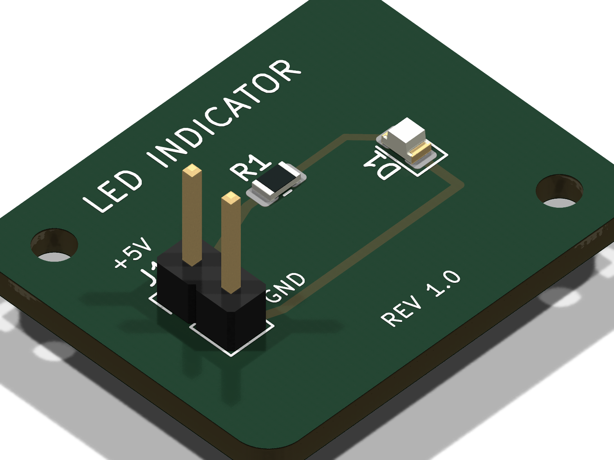

# RF AI Suite

[](https://www.debian.org/)
[](https://kicad.org/)
[](https://www.freecad.org/)
[](https://openems.de/)
[](https://ra3xdh.github.io/)
[](https://ngspice.sourceforge.io/)
[](https://www.python.org/)
[](https://www.docker.com/)

An all-in-one containerized Linux engineering platform designed for **RF & microwave engineering, PCB synthesis, 3D electromagnetic co-simulation, and AI-driven hardware automation**.

`rf-ai-suite` packages the entire modern open-source EDA, CAD, and RF solver ecosystem into a unified, reproducible Docker environment. It empowers human engineers and autonomous AI coding agents (Claude, Gemini, Antigravity, MCP) to synthesize schematics, route PCBs, run full-wave 3D FDTD simulations, and export production-ready Gerbers and raytraced 3D renders headlessly without installing gigabytes of complex desktop software on the host machine.

---

## Key Capabilities

- **Zero Host Pollution**: All toolchains—from C++ compilers and solvers to GUI window managers—run inside a Debian 13 (Trixie) Linux container.
- **Autonomous AI Agent Native**: Built-in Python 3.13 bindings (`pcbnew`, `FreeCAD`, `CSXCAD`, `openEMS`, `skrf`) and FastMCP server allow LLM agents to execute deterministic hardware workflows and DRC audits headlessly.
- **Native 3D Raytracing**: Full integration with KiCad 10's native CLI raytracer (`kicad-cli pcb render`) to generate high-resolution photorealistic board renders with floor shadows and component 3D models.
- **Full-Wave 3D EM Simulation**: Pre-compiled openEMS (v0.37.0-rc2) with multi-port S-parameter extraction, Touchstone `.sNp` export, and AppCSXCAD 3D mesh inspection.
- **RF Circuit & Harmonic Simulation**: Qucs-S with `qucsator-rf` and `ngspice-44.2` for RF co-simulation, transient analysis, S-parameter sweeps, and de-embedding.
- **Parametric 3D CAD Modeling**: FreeCAD 1.0 with the Microwave Workbench for transmission line calculations (microstrip, CPWG, stripline) and automated FreeCAD-to-openEMS geometry export.
- **Integrated Browser GUI (noVNC)**: Full interactive X11 desktop accessible in any modern web browser at `http://localhost:6080` (no Windows X-server or client installation required).

---

## Tool Suite & Version Matrix

| Category | Tool / Package | Version | Scope & Capabilities |
| :--- | :--- | :--- | :--- |
| **PCB & EDA** | **KiCad 10** | 10.0.4 | Schematic capture, headless DRC verification, Gerber/drill generation |
| | **KiCad Python (`pcbnew`)** | 10.0.4 (Py 3.13) | Programmatic board synthesis, trace routing, via stitching, copper fills |
| | **KiCad 3D Raytracer** | 10.0.4 | Headless photorealistic raytraced 3D board rendering (`kicad-cli pcb render`) |
| | **RF-tools-KiCAD** | Latest | Automated via fence stitching, track rounding, solder mask expansion |
| **Electromagnetics** | **openEMS & CSXCAD** | v0.37.0-rc2 | 3D full-wave FDTD solver, multi-port S-parameter matrix extraction |
| | **AppCSXCAD** | v0.37.0 | Interactive 3D FDTD mesh, bounding box, and excitation port visualizer |
| **Circuit Simulation**| **Qucs-S** | 24.4.1 | Schematic capture, Touchstone `.sNp` co-simulation, AC/DC analysis |
| | **qucsator-rf** | 1.0.3 | High-speed RF solver fork, stability factors ($K, \mu$), noise parameters |
| | **ngspice** | 44.2 | SPICE engine for non-linear transistor DC bias and transient sweeps |
| **3D Mechanical CAD**| **FreeCAD** | 1.0.0 | Parametric CAD modeling, headless STEP/STL generation, clearance audits |
| | **FreeCAD-Microwave** | Master | Transmission line calculators (CPWG, microstrip), FreeCAD-to-openEMS export |
| **RF & Math Stack** | **scikit-rf (`skrf`)** | >=1.2 | S-parameter matrix operations, de-embedding, Smith charts, Touchstone I/O |
| | **Scientific Python** | `numpy`, `scipy`, `matplotlib`, `pandas`, `h5py` | Numerical computation, optimization, publication-quality RF plotting |
| | **Vector & Photomask** | `pypdfium2`, `pillow`, `cairosvg`, `svglib` | High-DPI rasterization of etching films and fabrication photomasks |
| **GUI & Remote** | **noVNC + Openbox** | 6080 / 5900 | Browser-accessible virtual desktop with application menu |

---

## Quick Start

### 1. Prerequisites
- **Docker**: [Docker Desktop](https://www.docker.com/products/docker-desktop/) (Windows with WSL 2 backend enabled) or Docker Engine on Linux.
- **Git**

### 2. Clone the Repository
```bash
git clone https://github.com/cholan2100/rf-ai-suite.git
cd rf-ai-suite
```

### 3. Build & Start the Environment
```bash
# Using Docker Compose:
docker compose up -d

# Or on Windows using the pre-configured launcher:
bin\rf-gui.bat
```

### 4. Access the Graphical Desktop
Open your browser and navigate to:
**[http://localhost:6080/vnc.html](http://localhost:6080/vnc.html)**

- **Default VNC Password**: `rfworkbench` (configurable in `.env`)
- Right-click anywhere on the desktop to launch **KiCad, FreeCAD, Qucs-S, AppCSXCAD**, or an X11 **Terminal**.

---

## Automated Reference Example: Simple LED PCB

The repository includes a complete end-to-end automated manufacturing pipeline in `examples/simple_led/` demonstrating how hardware can be synthesized, verified, and exported headlessly without any manual CAD manipulation.

<p align="center">
  
</p>

### Pipeline Workflow
Running `examples/simple_led/run_pipeline.py` executes the following automated stages:

1. **Programmatic PCB Synthesis (`generate_led_pcb.py`)**:
   - Initializes a 2-layer PCB (25.0 mm × 20.0 mm) with corner radiuses.
   - Defines electrical nets: `+5V`, `GND`, and `NET_LED_ANODE`.
   - Loads and places standard footprints (`J1` 2-pin header, `R1` 0805 resistor, `D1` 0805 LED, M2 mounting holes).
   - Routes 45-degree copper tracks between components.
   - Pours solid top and bottom ground copper zones.
   - Places silkscreen reference designations and markings.
   - Saves the board as `led_board.kicad_pcb`.

2. **Headless Design Rule Check (DRC)**:
   - Invokes `kicad-cli pcb drc --format json` to inspect clearances, track widths, and zone connectivity.
   - Guarantees 0 violations and 0 warnings before proceeding.

3. **Production Gerber & NC Drill Export**:
   - Generates industry-standard RS-274X Gerber photoplots (copper, solder mask, silkscreen, paste, edge cuts) and Excellon NC drill files into `gerbers/`.

4. **Vector Photomask Export**:
   - Exports high-resolution vector SVG artwork for top and bottom copper/silkscreen layers into `renders/`.

5. **Mechanical 3D STEP Export**:
   - Exports a 3D mechanical CAD model (`led_board.step`) for mechanical enclosure verification.

6. **Photorealistic 3D Raytracing**:
   - Headlessly renders photorealistic 3D raytraced visualization (`iso_render.png`) with floor reflections and component 3D packages using KiCad 10's native raytracer.

### Running the Example
Inside the container:
```bash
python examples/simple_led/run_pipeline.py
```

Or from your host machine (Windows):
```powershell
bin\rf-run.bat python examples/simple_led/run_pipeline.py
```

### Pipeline Output:
```text
======================================================================
  SIMPLE LED PCB - AUTOMATED PRODUCTION PIPELINE
======================================================================

[Step 1/6] Synthesizing PCB layout with pcbnew...
[SUCCESS] PCB file successfully generated: led_board.kicad_pcb
  Dimensions: 25.0 mm x 20.0 mm
  Tracks: 8
  Zones: 2

[Step 2/6] Running Design Rule Check (DRC) with kicad-cli...
DRC completed! Violations: 0, Warnings: 0

[Step 3/6] Exporting Production Gerbers and NC Drill...
Exported 31 Gerber & Drill files into gerbers/

[Step 4/6] Exporting Vector SVG Artwork...
  - Top Artwork:    renders/led_board_top.svg
  - Bottom Artwork: renders/led_board_bottom.svg

[Step 5/6] Exporting 3D STEP Mechanical Model...
  - 3D STEP Model:  renders/led_board.step

[Step 6/6] Generating Photorealistic 3D Raytraced Render...
  - 3D Isometric Raytrace: renders/iso_render.png

======================================================================
  [SUCCESS] LED PCB MANUFACTURING PIPELINE COMPLETE!
======================================================================
```

---

## Convenience Launchers (`bin/`)

For maximum productivity, pre-configured host scripts are provided in `bin/`:

| Script | Platform | Description |
| :--- | :--- | :--- |
| **`bin\rf-run.bat`** (or `.ps1`) | Windows | Executes any command headlessly inside the running container. |
| **`bin\rf-bash.bat`** (or `.ps1`) | Windows | Opens an interactive bash shell in `/workspace`. |
| **`bin\rf-gui.bat`** (or `.ps1`) | Windows | Starts the container and opens the noVNC desktop in your default browser. |
| **`bin\rf-kicad.bat`** | Windows | Launches KiCad GUI in the virtual desktop and opens browser. |
| **`bin\rf-qucs.bat`** | Windows | Launches Qucs-S RF simulator in the virtual desktop. |
| **`bin\rf-freecad.bat`** | Windows | Launches FreeCAD GUI in the virtual desktop. |
| **`bin\rf-openems.bat`** | Windows | Launches AppCSXCAD 3D mesh visualizer. |

---

## System Verification

To verify that all 14 EDA, CAD, EM solver, and rendering subsystems are fully operational:

```bash
# Inside container:
python tests/verify_environment.py

# From Windows host:
bin\rf-run.bat python tests/verify_environment.py
```

All 14 diagnostic checks test:
- [x] KiCad CLI (`kicad-cli`) and Python API (`pcbnew`)
- [x] FreeCAD CLI (`freecadcmd`) and Python API (`FreeCAD`, `Part`, `Mesh`)
- [x] FreeCAD Microwave Workbench (`Microwave.Solvers.openems`)
- [x] openEMS binary and Python modules (`CSXCAD`, `openEMS`)
- [x] Qucs-S solvers (`qucsator`, `qucsator_rf`, `ngspice`)
- [x] scikit-rf (`skrf`) Touchstone matrix manipulation
- [x] High-DPI mask rendering (`pypdfium2`, `PIL`)
- [x] FastMCP KiCad integration
- [x] RF-tools-KiCAD plugin directory

---

## Project Structure

```
rf-ai-suite/
├── docker-compose.yml              # Container orchestration & volume bindings
├── Dockerfile                      # Debian 13 multi-stage EDA/solver build
├── .env.example                    # Template configuration file
├── requirements.txt                # Python RF, simulation, and CAD dependencies
├── entrypoint.sh                   # Container entrypoint (Xvfb, noVNC, CLI runner)
├── bin/                            # Host convenience scripts (.bat and .ps1)
│   ├── rf-run.bat / .ps1           # Headless command runner
│   ├── rf-gui.bat / .ps1           # Web desktop launcher
│   ├── rf-bash.bat / .ps1          # Interactive bash shell
│   ├── rf-kicad.bat                # Direct KiCad shortcut
│   ├── rf-qucs.bat                 # Direct Qucs-S shortcut
│   ├── rf-freecad.bat              # Direct FreeCAD shortcut
│   └── rf-openems.bat              # Direct AppCSXCAD shortcut
├── config/
│   ├── openbox-rc.xml              # Openbox window manager keybindings & theme
│   └── openbox-menu.xml            # Desktop right-click application menu
├── examples/
│   └── simple_led/                 # Automated reference manufacturing pipeline
│       ├── generate_led_pcb.py     # Programmatic board synthesis (pcbnew)
│       ├── run_pipeline.py         # 6-step automated build, DRC, Gerber, 3D pipeline
│       ├── gerbers/                # Exported production Gerber & drill files
│       └── renders/                # Vector SVGs, 3D STEP model, and raytraced PNGs
├── scripts/
│   ├── install_openems.sh          # Source build script for openEMS v0.37.0-rc2
│   ├── install_qucs.sh             # Source build script for Qucs-S & qucsator-rf
│   └── setup_plugins.sh            # Action plugins (RF-tools, FreeCAD-Microwave)
└── tests/
    └── verify_environment.py       # Comprehensive 14-point diagnostic suite
```

---

## License

This project is licensed under the [MIT License](LICENSE).
