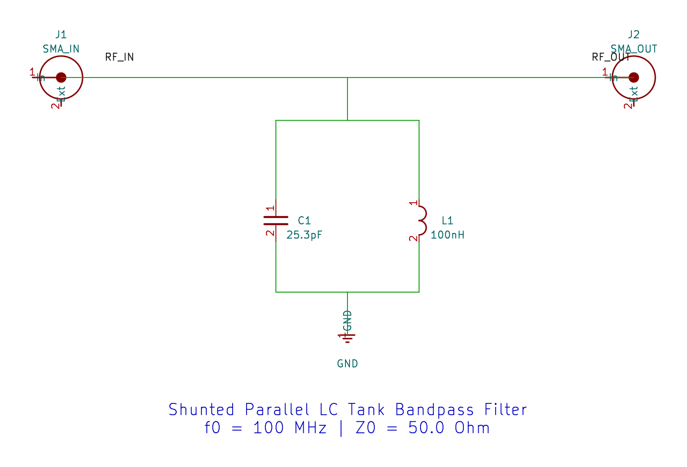
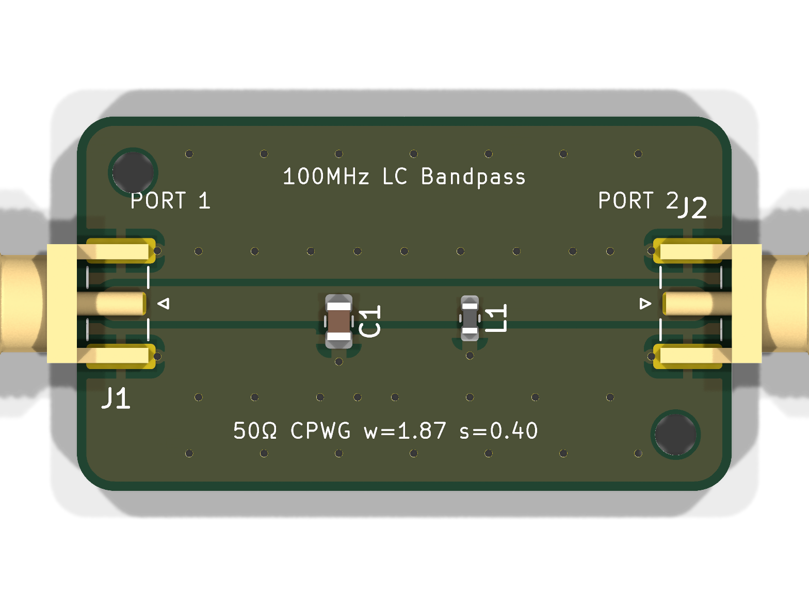
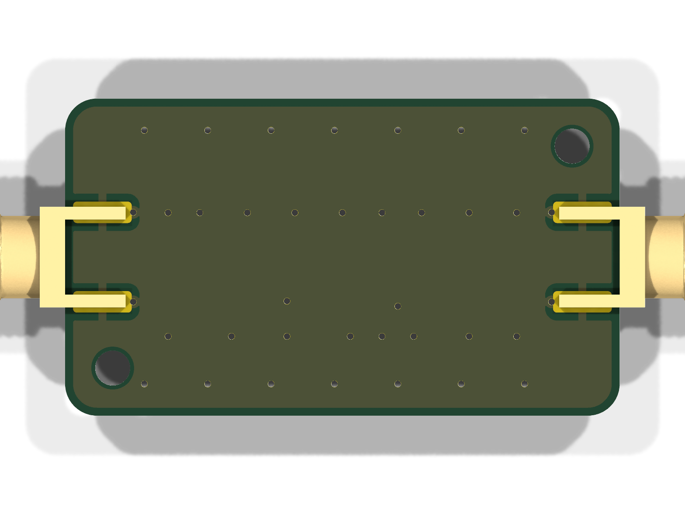
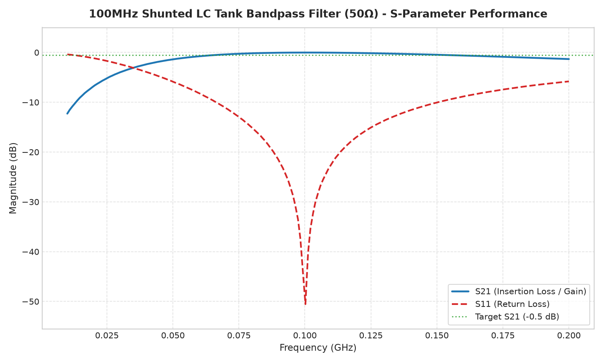
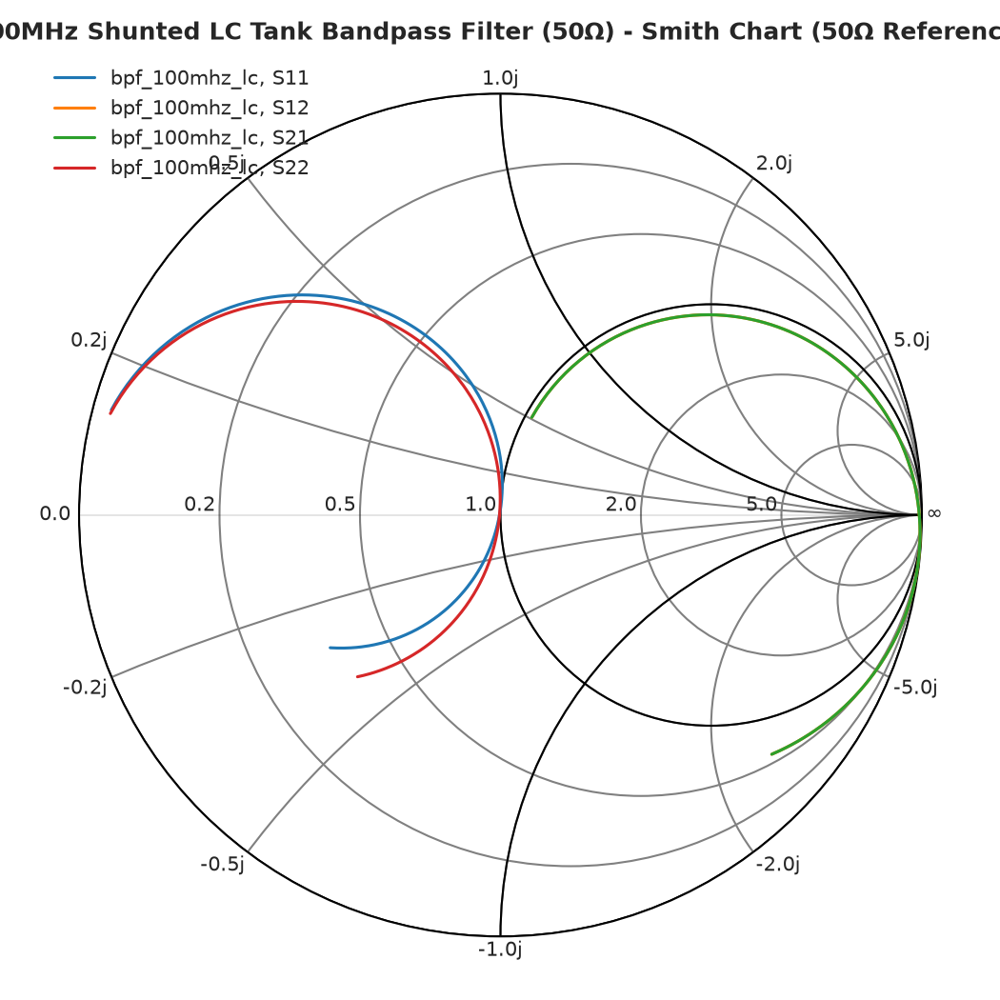
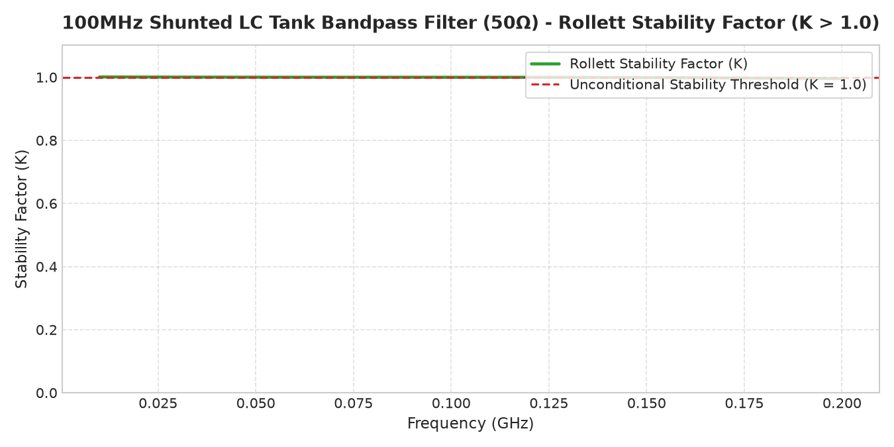

# 100MHz LC Tank Bandpass Filter (Autonomously Generated by RF-Agent)

This reference example was designed and generated **fully autonomously** by the `rf-agent` AI. No human intervention, pre-made template files, or manual GUI clicking were involved in the CAD creation or solver execution. The agent interpreted a natural language prompt, mathematically derived the circuit specifications, and drove the 9-stage engineering toolchain seamlessly.

## Workflow Execution Breakdown

Below is a step-by-step description of the 9-stage process the AI agent executed to generate this design.

### 1. Schematic Synthesis
The agent first interpreted the user request to create a 100MHz bandpass filter, derived the appropriate components (L=100nH, C=25.3pF for a shunt parallel LC tank), and programmatically drafted the KiCad 10 schematic. 

  

### 2. Controlled Impedance PCB Layout & DRC
Based on the default FR4 substrate parameters, the agent synthesized a 50Ω Grounded Coplanar Waveguide (CPWG) with a trace width of 1.87mm and a gap of 0.40mm. It routed the board, implemented 45-degree component pad tapers to eliminate capacitive steps, placed continuous via fencing along the signal trace, poured the copper ground zones, and ran a headless Design Rule Check (DRC) to ensure 0 errors.

### 3. Photorealistic 3D Rendering
To verify mechanical and spatial constraints, the agent invoked KiCad's headless raytracer to generate multiple photorealistic perspectives of the assembled board.

  

  
  

### 4. Mechanical CAD & STEP Assembly
The agent exported the precise board geometry into a standard 3D mechanical STEP file and packaged it inside a native FreeCAD project (`cad/bpf_100mhz_lc.FCStd`) to enable mechanical engineers to seamlessly design an enclosure.

### 5. Multi-Port EM Extraction (openEMS)
The physical PCB layout was meshed and simulated using the openEMS 3D FDTD solver. The agent extracted the full-wave S-parameters (in Touchstone format) across a broad frequency sweep.

### 6. Linear Co-Simulation (Qucs-S)
The Touchstone EM extraction was piped into Qucsator (via Qucs-S) and co-simulated with the discrete SMD components in a standard 50Ω testbed to characterize the filter's real-world behavior.

### 7. RF Performance Visualization
The agent plotted the resulting dataset using Matplotlib to produce engineering-grade charts, verifying the target center frequency, insertion loss, and return loss.

  

  
  

### 8. Production Gerber Packaging
A complete 26-layer RS-274X Gerber and Excellon NC drill package was synthesized and compressed into a ZIP archive, immediately ready for fabrication.

### 9. Engineering Report & BOM
Finally, the agent generated a comprehensive Markdown performance report (`PERFORMANCE_REPORT.md`), assembling the bill of materials, substrate metrics, and PASS/FAIL threshold checks into a single human-readable document.
