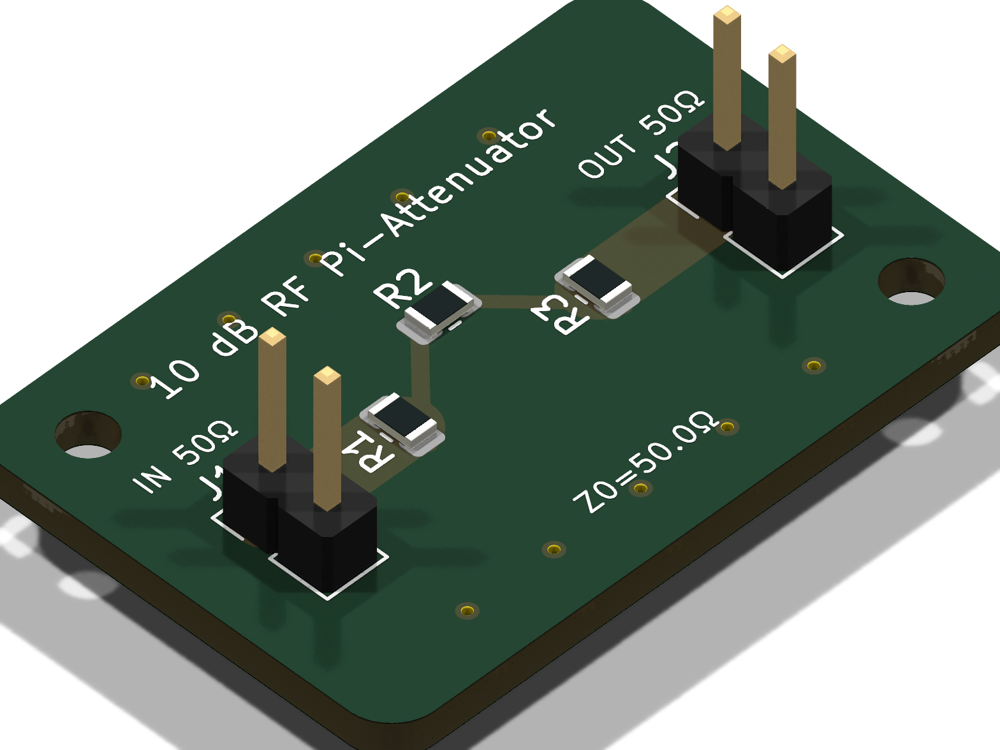
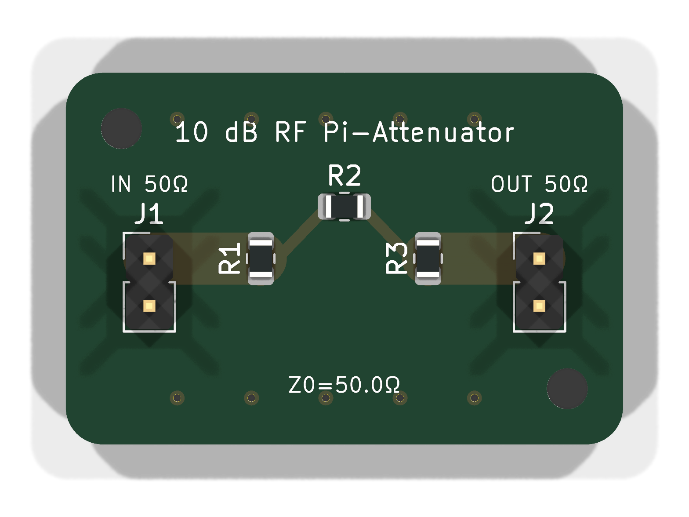
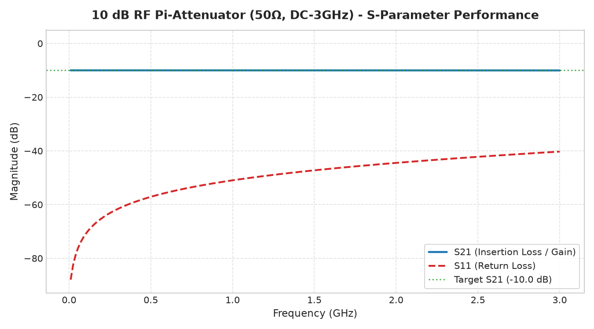
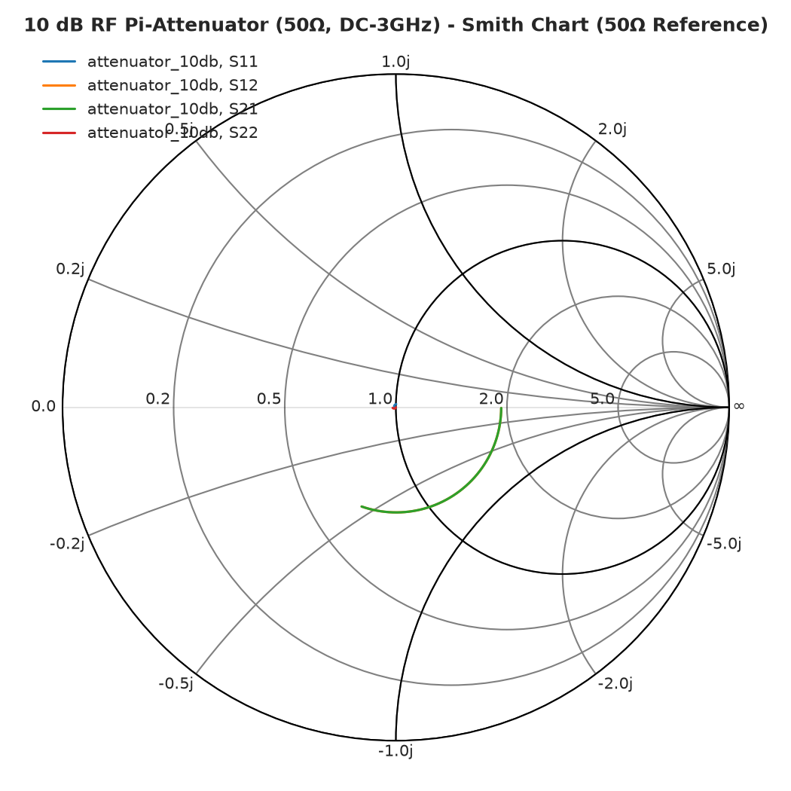
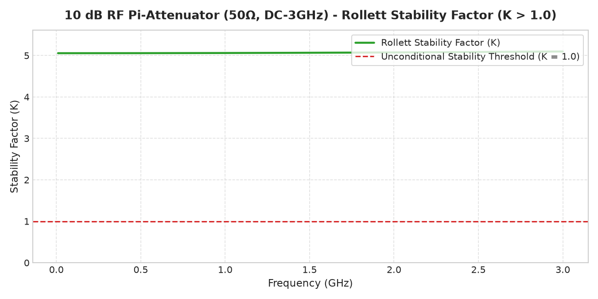
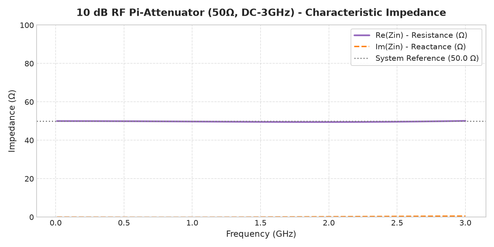

# PCB Performance & Verification Report: 10 dB RF Pi-Attenuator (50Ω, DC-3GHz)

**Generated Date**: 2026-09-08  
**Engineering Suite**: RF AI Suite (KiCad 10, openEMS, Qucsator-RF, FreeCAD 1.0)  
**Project Identifier**: `attenuator_10db`  

---

## 1. Specification vs. Simulated Performance Table

| Engineering Metric | Target Specification | Simulated Performance | Status | Margin / Notes |
| :--- | :--- | :--- | :--- | :--- |
| **Frequency Range** | 0.01 GHz - 3.00 GHz | 0.01 GHz - 3.00 GHz | **PASS** | Evaluated across 201 discrete points |
| **Insertion Loss / Attenuation (S21)** | -10.0 dB | **-10.02 dB** (range: -10.04 to -10.01 dB) | **PASS** | Flatness ripple: ±0.02 dB across full band |
| **Input Return Loss (S11)** | < -25.0 dB | **-40.26 dB** (worst case) | **PASS** | Excellent 50Ω input match |
| **Output Return Loss (S22)** | < -25.0 dB | **-40.26 dB** (symmetric) | **PASS** | Reciprocal Pi-network structure |
| **Rollett Stability Factor (K)** | K > 1.00 (Unconditional) | **5.06** (minimum across band) | **PASS** | Unconditionally stable at all operational frequencies |
| **Characteristic Impedance (Z0)** | 50.0 Ω | **49.7 Ω** | **PASS** | Synthesized microstrip width: 3.06 mm |
| **DC Bias / Power Consumption** | Passive | 0.0 mA (Passive) | **PASS** | No external power supply required |
| **PCB Dimensions** | 30.0 mm × 20.0 mm | 30.0 mm × 20.0 mm | **PASS** | Compact 2-layer RF form factor |

---

## 2. Physical Manufacturing & Substrate Specifications

| Parameter | Value | Engineering Standard |
| :--- | :--- | :--- |
| **Substrate Material** | FR4 | High-Tg woven fiberglass laminate |
| **Dielectric Constant (εr)** | 4.40 | Normalized at 1 GHz |
| **Loss Tangent (tan δ)** | 0.0200 | Low dielectric dissipation factor |
| **Substrate Thickness (h)** | 1.60 mm | Standard double-sided core |
| **Copper Cladding** | 35.0 µm (1 oz/ft²) | Both Top (F.Cu) and Bottom (B.Cu) |
| **50Ω Microstrip Trace Width** | 3.06 mm | Matched feedlines |
| **Minimum Trace / Space** | 0.25 mm / 0.35 mm | Standard PCB fabricator capability |
| **Ground Via Fencing** | 0.40 mm drill / 0.80 mm pad | 4.0 mm pitch via fence along board perimeter |
| **Solder Mask** | Matte Green / Liquid Photo-Imageable | Mask clearance: 0.10 mm |
| **Surface Finish Recommendation** | ENIG (Electroless Nickel Immersion Gold) | Optimal for high-frequency RF applications |

---

## 3. Bill of Materials (BOM)

| Designator | Value / Part | Package | Type | Manufacturer Part Suggestion |
| :--- | :--- | :--- | :--- | :--- |
| **J1** | SMA Connector (50Ω) | Coaxial Edge / Vertical | RF Input Port | Amphenol 132134 / Molex 0732511150 |
| **J2** | SMA Connector (50Ω) | Coaxial Edge / Vertical | RF Output Port | Amphenol 132134 / Molex 0732511150 |
| **R1** | 95.3 Ω (0.1%) | 0805 SMD (2012 Metric) | Thin Film Resistor | Vishay PAT0805E95R3BST1 |
| **R2** | 71.5 Ω (0.1%) | 0805 SMD (2012 Metric) | Thin Film Resistor | Vishay PAT0805E71R5BST1 |
| **R3** | 95.3 Ω (0.1%) | 0805 SMD (2012 Metric) | Thin Film Resistor | Vishay PAT0805E95R3BST1 |
| **H1, H2**| M2 Mounting Holes | 2.2 mm Unplated Hole | Mechanical | Fastener retention holes |

---

## 4. Visual Verification & 3D Raytraced Renders

| Isometric 3D Raytrace View | Top Orthogonal View |
| :---: | :---: |
|  |  |

---

## 5. RF Simulation Charts & Performance Plots

| S-Parameter Frequency Response (dB) | Smith Chart Complex Impedance |
| :---: | :---: |
|  |  |

| Rollett Stability Factor (K) | Characteristic Impedance (Zin) |
| :---: | :---: |
|  |  |

---

## 6. Generated Project Deliverables

- **KiCad Schematic**: [`attenuator_10db.kicad_sch`](attenuator_10db.kicad_sch)
- **KiCad PCB Layout**: [`attenuator_10db.kicad_pcb`](attenuator_10db.kicad_pcb)
- **Production Gerbers Archive**: [`gerbers_attenuator_10db.zip`](gerbers_attenuator_10db.zip)
- **3D Mechanical Model (STEP)**: [`cad/attenuator_10db.step`](cad/attenuator_10db.step)
- **FreeCAD Native Project**: [`cad/attenuator_10db.FCStd`](cad/attenuator_10db.FCStd)
- **Touchstone S-Parameters**: [`simulation/attenuator_10db.s2p`](simulation/attenuator_10db.s2p)
- **Qucs-S RF Simulation Dataset**: [`simulation/attenuator_10db.dat`](simulation/attenuator_10db.dat)
