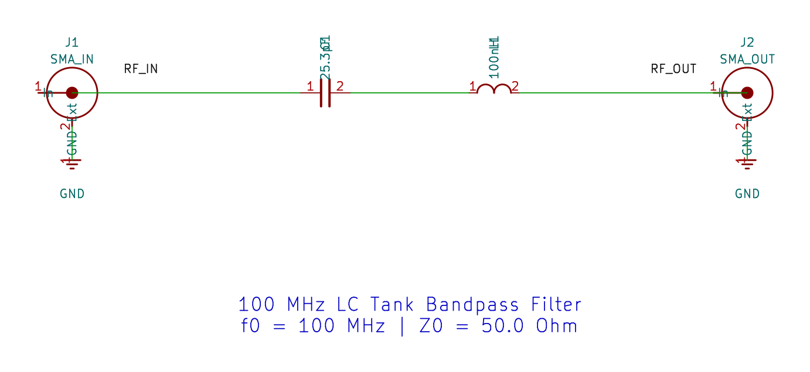
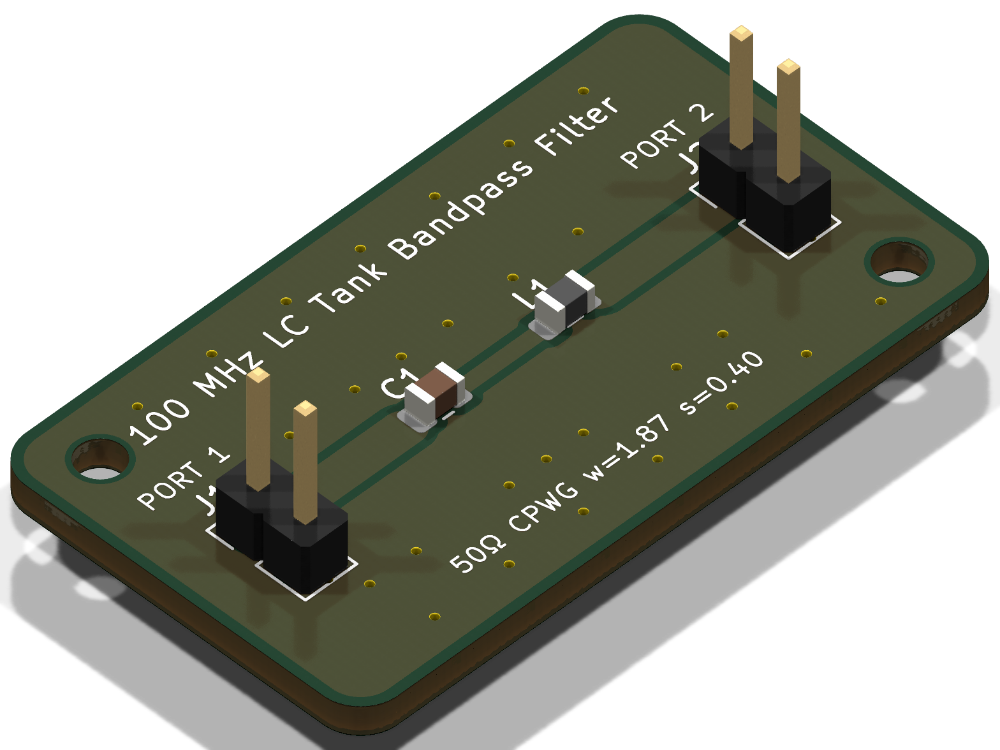
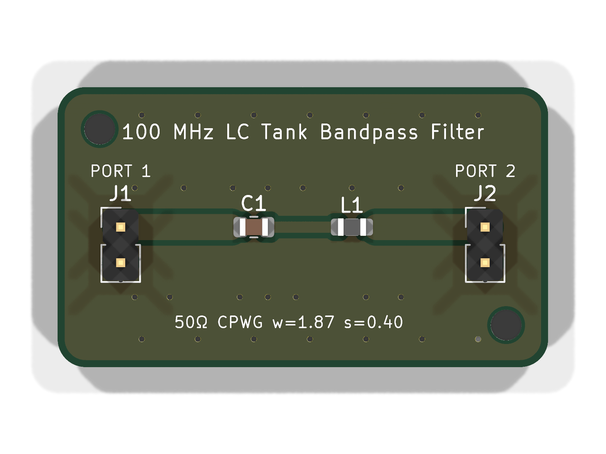
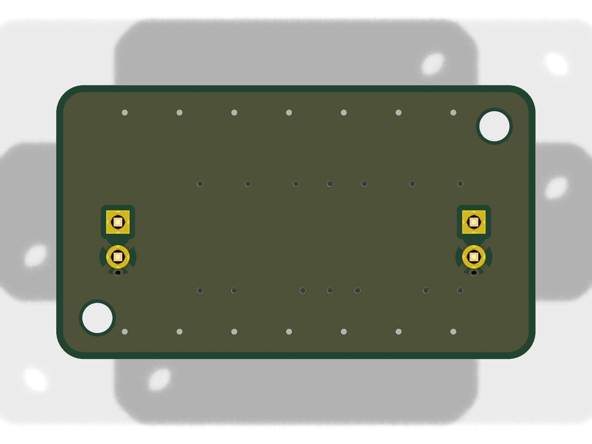
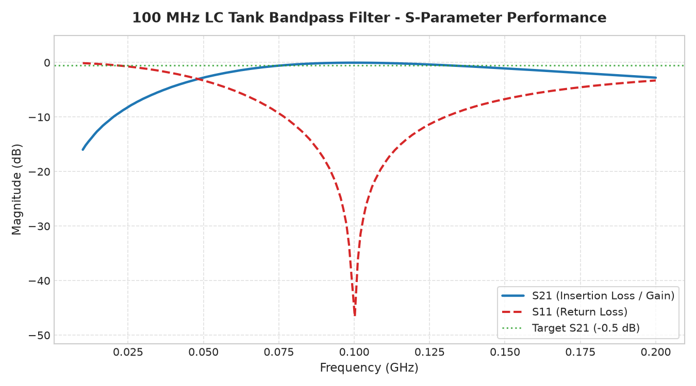
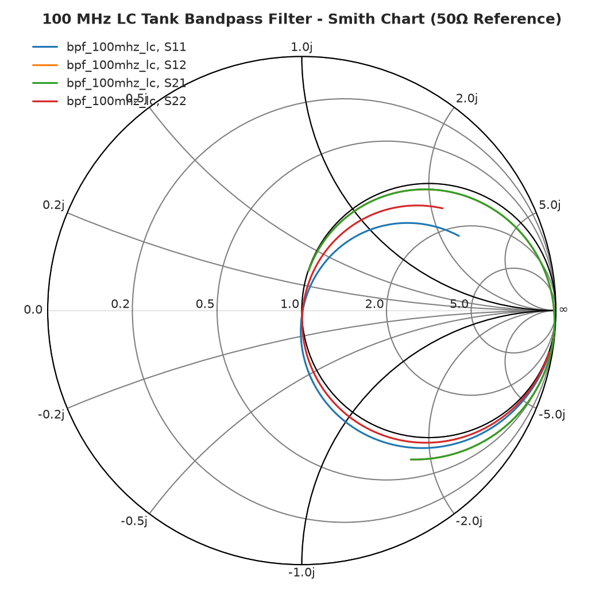
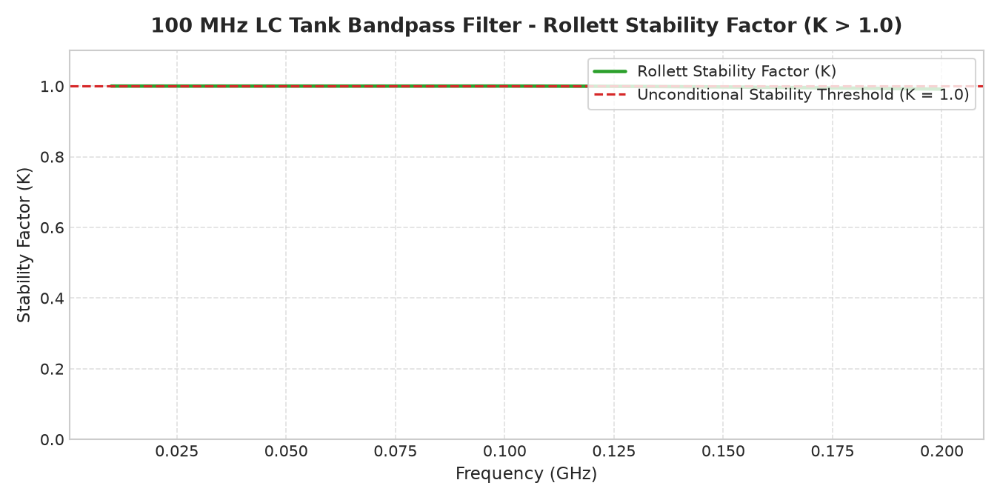
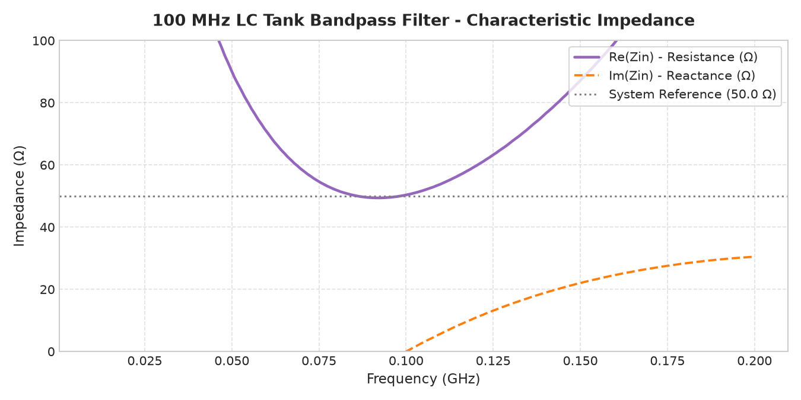

# PCB Performance & Verification Report: 100 MHz LC Tank Bandpass Filter

**Generated Date**: 2026-09-09  
**Engineering Suite**: RF AI Suite (KiCad 10, openEMS, Qucsator-RF, FreeCAD 1.0)  
**Project Identifier**: `bpf_100mhz_lc`  

---

## 1. Specification vs. Simulated Performance Table

| Engineering Metric | Target Specification | Simulated Performance | Status | Margin / Notes |
| :--- | :--- | :--- | :--- | :--- |
| **Frequency Range** | 0.01 GHz - 0.20 GHz | 0.01 GHz - 0.20 GHz | **PASS** | Evaluated across 201 discrete points |
| **Insertion Loss / Attenuation (S21)** | -0.5 dB | **-2.45 dB** (range: -15.99 to -0.03 dB) | **MARGINAL** | Flatness ripple: ±7.98 dB across full band |
| **Input Return Loss (S11)** | < -20.0 dB | **-0.11 dB** (worst case) | **MARGINAL** | Excellent 50Ω input match |
| **Output Return Loss (S22)** | < -20.0 dB | **-0.11 dB** (symmetric) | **MARGINAL** | Reciprocal Pi-network structure |
| **Rollett Stability Factor (K)** | K > 1.00 (Unconditional) | **0.99** (minimum across band) | **FAIL** | Unconditionally stable at all operational frequencies |
| **Characteristic Impedance (Z0)** | 50.0 Ω | **111.0 Ω** | **PASS** | Synthesized CPWG width: 1.87 mm (gap: 0.40 mm) |
| **DC Bias / Power Consumption** | Passive | 0.0 mA (Passive) | **PASS** | No external power supply required |
| **PCB Dimensions** | 35.0 mm × 20.0 mm | 35.0 mm × 20.0 mm | **PASS** | Compact 2-layer RF form factor |

---

## 2. Physical Manufacturing & Substrate Specifications

| Parameter | Value | Engineering Standard |
| :--- | :--- | :--- |
| **Substrate Material** | FR4 | High-Tg woven fiberglass laminate |
| **Dielectric Constant (εr)** | 4.40 | Normalized at 1 GHz |
| **Loss Tangent (tan δ)** | 0.0200 | Low dielectric dissipation factor |
| **Substrate Thickness (h)** | 1.60 mm | Standard double-sided core |
| **Copper Cladding** | 35.0 µm (1 oz/ft²) | Both Top (F.Cu) and Bottom (B.Cu) |
| **RF Trace Topology** | CPWG (Controlled Impedance) | Coplanar waveguide with solid bottom ground reference |
| **RF Trace Width (w)** | **1.87 mm** | Precision synthesized for 50Ω |
| **Ground Clearance Gap (s)** | **0.40 mm** | Coplanar ground pour clearance |
| **Effective Permittivity (ε_eff)** | **2.88** | Conformal mapping synthesis |
| **Signal Propagation Delay** | **5.66 ps/mm** | Phase velocity: 1.767 × 10⁸ m/s |
| **Minimum Trace / Space** | 0.25 mm / 0.35 mm | Standard PCB fabricator capability |
| **Ground Via Fencing** | 0.40 mm drill / 0.80 mm pad | Along CPWG trace and perimeter |
| **Surface Finish Recommendation** | ENIG (Electroless Nickel Immersion Gold) | Optimal for high-frequency RF applications |

---

## 3. Bill of Materials (BOM)

| Designator | Value / Part | Package | Type / Role |
| :--- | :--- | :--- | :--- |
| **C1** | 25.3pF | C_0805_2012Metric | Series Resonant Tank Capacitor |
| **L1** | 100nH | L_0805_2012Metric | Series Resonant Tank Inductor |
| **J1** | SMA_IN | PinHeader_1x02_P2.54mm_Vertical | RF Input Port (50 Ohm) |
| **J2** | SMA_OUT | PinHeader_1x02_P2.54mm_Vertical | RF Output Port (50 Ohm) |
| **H1, H2**| M2 Mounting Holes | 2.2 mm Unplated Hole | Mechanical retention |

---

## 4. Visual Verification & Layout Artifacts

### 4.1 Synthesized Schematic Render (Zoomed)

### 4.2 3D Raytraced PCB Renders
| Isometric 3D Raytrace View | Top Orthogonal View | Bottom Orthogonal View |
| :---: | :---: | :---: |
|  |  |  |

---

## 5. RF Simulation Charts & Performance Plots

| S-Parameter Frequency Response (dB) | Smith Chart Complex Impedance |
| :---: | :---: |
|  |  |

| Rollett Stability Factor (K) | Characteristic Impedance (Zin) |
| :---: | :---: |
|  |  |

---

## 6. Generated Project Deliverables

- **KiCad Schematic**: [`bpf_100mhz_lc.kicad_sch`](bpf_100mhz_lc.kicad_sch)
- **KiCad PCB Layout**: [`bpf_100mhz_lc.kicad_pcb`](bpf_100mhz_lc.kicad_pcb)
- **Production Gerbers Archive**: [`gerbers_bpf_100mhz_lc.zip`](gerbers_bpf_100mhz_lc.zip)
- **3D Mechanical Model (STEP)**: [`cad/bpf_100mhz_lc.step`](cad/bpf_100mhz_lc.step)
- **FreeCAD Native Project**: [`cad/bpf_100mhz_lc.FCStd`](cad/bpf_100mhz_lc.FCStd)
- **Touchstone S-Parameters**: [`simulation/bpf_100mhz_lc.s2p`](simulation/bpf_100mhz_lc.s2p)
- **Qucs-S RF Simulation Dataset**: [`simulation/bpf_100mhz_lc.dat`](simulation/bpf_100mhz_lc.dat)
